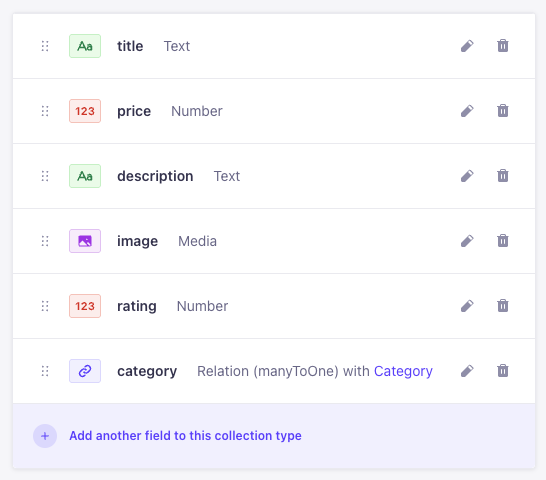
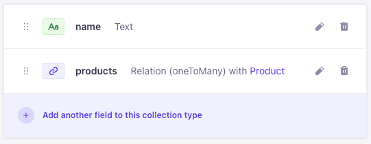

# Strapstro

Let us join the forces of Strapi and Astro to create a new version of the Fake Store.

## Project organization

Create a new folder called 'strapstro' for this project and initialize a new git repository.
Inside the project folder create two new folders: `frontend` and `backend`.

```bash
strapstro
  ├── frontend
  └── backend
```

## Backend - Strapi

Make sure you are in the backend directory and create a new project there. Don't create another git repository in the backend folder.

```bash
cd backend
npm create strapi@latest .
```

Create the content types, necessary to simulate the Fakestore API.
It should be something like the following screenshots.
**Turn the draft/publish switch off.** It would be rather annoying at this time.

Pay attention to the casing of the fields. Strapi will use that casing in the REST API.
The **price and rating** fields are of type **decimal**.

### Product



### Category



### Importing data

You don't have to copy-paste the data yourself. There is a little script provided that will do it for you. Have a look at he `productimporter` project. This is a nodeJS script that will fetch the products from the fakestore API and import them into our Strapi project, also with the REST api.

It is important to set the permissions for the `product` and `category` content types to `find` and `findone` and `create` for the public role.
Also check `upload` under the `Media Library` section.

If everything went well, you should be able to see the products and categories in the admin panel + you REST API should be working.

If it doesn't work, try to find out what is wrong by making the script a bit more verbose. Don't forget to remove partially imported data.

## Frontend - Astro

You can start with our previous Astro fakestore. Copy the whole project into the `frontend` folder. The package.json file should be in the root of the `frontend` folder.

### 2 processes

You have to keep two processes running. One for the backend and one for the frontend. This means you have to open two terminals.

### Strapi url

We need to set the Strapi url in our Astro project somehow. Imagine we would hardcode the url in our code, every time we change the url of the Strapi server, we would have to change it in our code. And what if we have different urls for development and production? Then we would have to change this on every build, terrible!

So we will use a `.env` file to store the url of the Strapi server. We will create a variable there which contains the url. It is simply a matter of using that variable in our code.
When we would run our project in a different _environment_, we only have to update that .env file.

Create a `.env` file in the root of the `frontend` folder and add the following line:

```bash
STRAPI_URL=http://localhost:1337
```

DO NOT COMMIT THIS FILE TO GIT! It can contain sensitive information like authentication keys and passwords.

### Astro and Strapi

Although using data from Strapi in Astro is a case of doing a fetch. Astro provides us with a nice little wrapper to make some things less repetitive.

Have a look at the [guide](https://docs.astro.build/en/guides/cms/strapi/) but take notice of the following:

- The wrapper is written in TypeScript. (There is a plain JS version provided with these instructions)
- We won't be creating interfaces for our content types
- We are not interested in "Server-side rendering" at this time.
- You can skip the "Publishing" part also

We've provided a the wrapper in the starter files, but we've optimized it a bit. You can pass the optional parameters as an object instead of a string. To parse it, we make use of the [`qs` library](https://www.npmjs.com/package/qs). (You have to install this first) Actually, [Strapi recommends this approach](https://docs.strapi.io/dev-docs/api/rest/interactive-query-builder)

You can place this wrapper in the src/lib folder.

### Implementation

Try to show the products on the home page by using the wrapper. You will have to tweak properties since Strapi structures its content differently than the fakestore API.

Some tips and tricks:

- See how a result from the Strapi API is returned, they are wrapped in a 'data' property.
- You will have to populate some extra data with your API requests, the product image is a relation...
- We simplified the rating property, it is just a number now.
- Since our images are stored on the Strapi server, they have a different url than the fakestore API. You will have to authorize `localhost` to get full advantage of the Image component.
- You can use the [Optional chaining](https://developer.mozilla.org/en-US/docs/Web/JavaScript/Reference/Operators/Optional_chaining) operator to have less error-prone code.
- You can make use of conditional rendering when certain properties are not present (when you didn't populate them)

Make sure you get the home page and the detail page working.

---

## Category pages

Extend our project with category pages. It is kind of the same approach as with the tag pages from the blog tutorial. Get the categories from the Strapi API in a getStaticPaths function. Try to show the page with a matching title first.

### ProductsList refactoring

Since we have to show all the products in a certain category, we could make use of the ProductsList component. There is an issue though: at the moment, we fetch all the products inside the ProductsList component. That is convenient for the home page, but not for the category pages. What if we could pass in a list of products to the ProductsList component? That's exactly what props are for!

- Refactor the ProductsList component so that it can accept a list of products as a prop.
- Refactor the home page so that it fetches all the products and sends it to the ProductsList component.
- In a category page, fetch the products for that category and send it to the ProductsList component.
- Be aware that you will have to populate all the **necessary** data for the products.

## Link to category page

On a product card, add a link to a category page. The link should be a simple anchor tag with an href attribute. The href should be the path to the category page. You can use the `slug` property of the category object for this. Add a 'UID' field to the category and name it `slug`, base it on the `name` field. You need to go over all the categories and set this field manually since they are not automatically created for existing data.

Only show the category on the detail page of a product. Because the cards are already links on the home page, you don't have to show the category link there.

## Client side filtering

We can show products from a certain category on a category page. These pages are generated at build time. But let us create something more interactive, even faster. We will create a client side filter.

### Filter component

There is a filter component in the starter files. You can start with this one, implement it on the homepage.

To decide if a product should be shown or not, we will use a [data attribute](https://developer.mozilla.org/en-US/docs/Learn/HTML/Howto/Use_data_attributes) on the `<li>` element wrapped around the article. So go ahead and make sure that the category slug is set as a data attribute like: `data-category="category-name"`

Create a CSS class `hidden` in the global stylesheet with a value of `display:none;` We will be hiding elements instead of removing them from the DOM, otherwise they are gone for further filter operations.

### Filter logic

- When any option changes: hide all products, select the ones that match the selected categories and show them.
- When no options are selected: show all products.

Time to dig up your good ol' `querySelectorAll` and `classList` skills and make this happen. The [attribute selector](https://developer.mozilla.org/en-US/docs/Web/CSS/Attribute_selectors) will come in handy.

## Transitions

Let us add a view transition to finish our project.

Start by enabling it [globally in the BaseLayout](https://docs.astro.build/en/guides/view-transitions/#enabling-view-transitions-spa-mode) component. Then, add a transition-name to the wrapper div in the product detail page. Use the product's documentId to make sure each product has its own unique transition name.

Finally, add the same transition-name to the product card's article in the ProductCard component.

### Let us check that filter again

At first, the filter will work. But when you navigate to another page and then back to the home page, the filter will not work anymore. See the [docs](https://docs.astro.build/en/tutorials/add-view-transitions/#update-scripts) for a solution.
